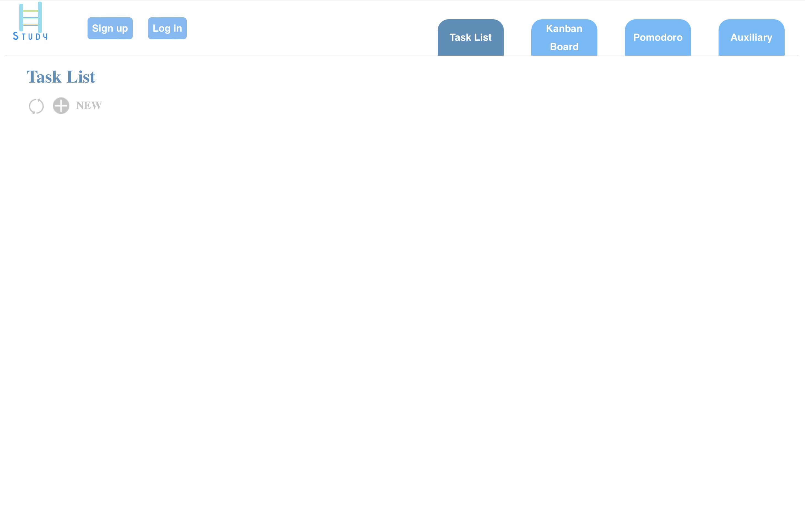
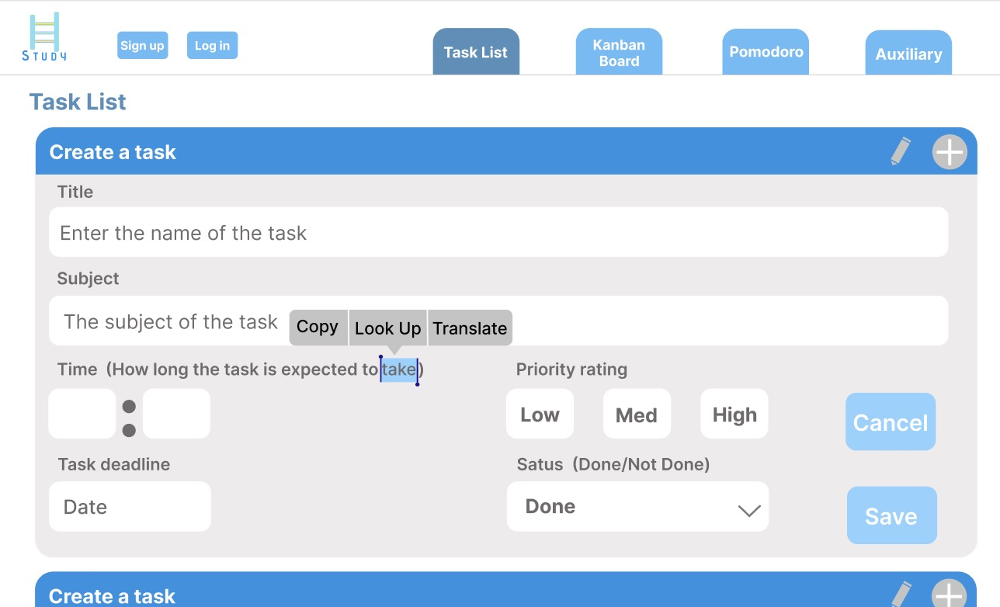
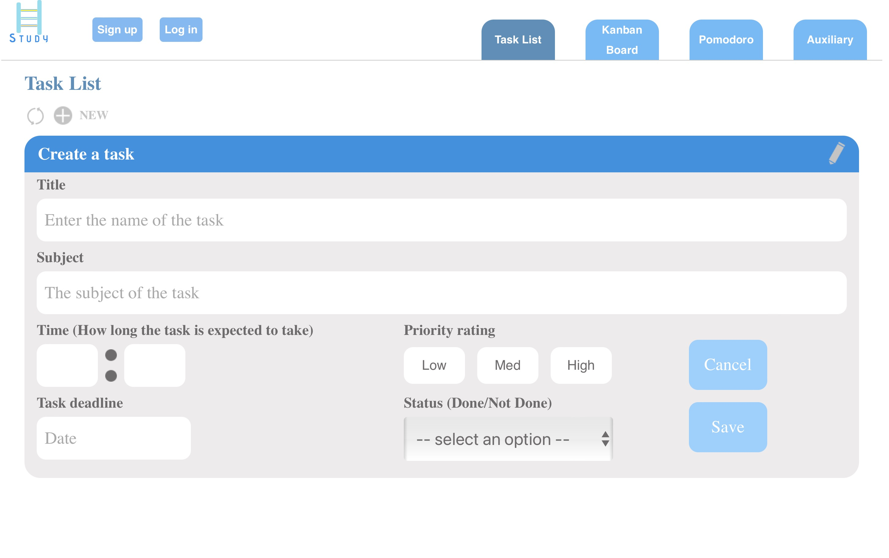
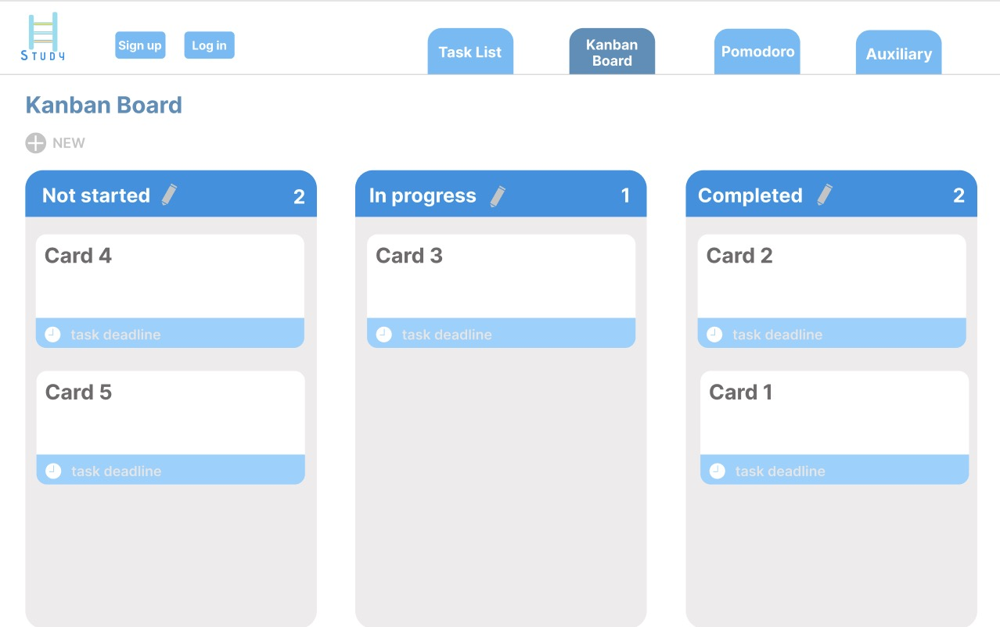
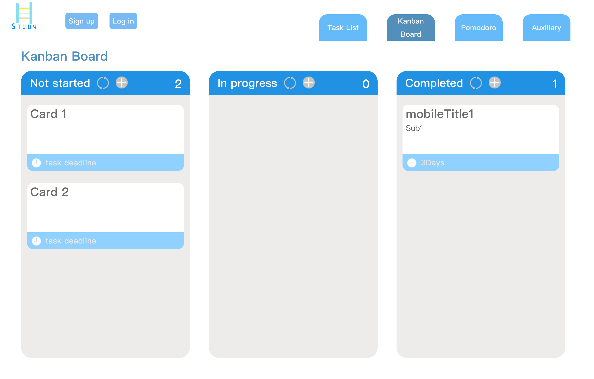

# Website Homepage

You can open the website by below url, this website also can be opened by mobile advices.

[https://bzhe6493.github.io/study-companion/](https://bzhe6493.github.io/study-companion/)

# Introduction about this website

"Learning" apps can help users better accomplish programming tasks. Users can divide a large task into several small tasks to complete. Create new tasks at any time. Each time it is created, a new panel is created for users to fill in task requirements, time requirements, etc. I want to change a task that was previously filled in incorrectly. The user can use the editing function.

The kanban board page allows users to clearly see each task. The list of kanban boards also includes deadlines for each task. In this way, users can better experience the role of the app in urging learning.

pomodoro is a timer that helps users manage their study time. Time is precious. If a programmer can't focus and does not have time management skill, a lot of time will pass. For experienced programmers, they can make good use of the time that is about to go by. This leaves more time to deal with network vulnerabilities. This timer user can adjust study and rest time at will. The countdown starts as soon as the timer starts. Better urge users to learn. Users can turn pomodoro on and off at will.

The auxiliary page has two functions. One function is a music player. Users listen to music when they are tired from studying or during a break. You can also listen to music when you can’t learn, so that users can calm down and continue to study hard. Another feature is the online API to query the meaning and synonyms of words. It can be used when users encounter unfamiliar words. The user can long press on the unrecognized word. Then click look up. The web page will jump directly to the dictionary and give the meaning of the word. Using this function to look up words is very convenient.

# The changes I made for imporving user experience

Task List page. I changed the location of the new function to make it easier for users to create new panels. I've added a refresh feature to give users a better experience when the network is unstable.







Kanban Board page. I added a refresh function. Users can get the tasks from task list by refresh button.

Before:


After:


# How I build the website

In this project, I choose to use Vue as my javaScript framework for building website interface. In my understanding, Vue provides a declarative and component-based programming model which is core concept of this framework. It's a little complicated, but it help me build this project faster.

For html part, I using the elements like div, input, h1, h2 ... Each elements has their special usage, and special style, so I need to use them in correct way. Like use h1 for website title, input for geting entered information.

For the css, because this website also supprot mobile screen, so I choose to use flex box which can help me build a responsive website.

The most tricky part for me is how to add dictionary in my website, I've no idea at the beginning, so I do some research about it and found this free Dictionary API:

```
https://dictionaryapi.dev/
```

It's awesome, by using API they provided, I can get the result I want. The next thing is add it in my website and show it in the page.

## How to setup this project

First you need open current folder in the terminal then run "npm install" script, it will install all necessary dependencies, then you run "npm run server" script, this is a script provided by Vue, by using this script you can see the website you are coding with Vue. You can open the page by using this link after script success: [link] (http://localhost:8080/)

## Build html, css and js files

By running "npm run build", this is also a script provided by Vue, after script success, it will generate html, css and js files and all images, music files in the dist folder. And the website can be opened by click index.html.


# Project tech list

1. html (div, input, h1, h2)
2. css (flex, float, margin, padding, absolute, relative)
3. vue3 (data, props, emit, methods)
4. axios (to request data)
 

# Reference
hand drawn black cartoon little girl (2022). Retrieved 17 April 2022, from https://www.51yuansu.com/sc/jvchkdmxuu.html

Smiling stick figure (2022). Retrieved 17 April 2022, from https://www.51yuansu.com/sc/crsxhipxwq.html

White IOS Clock Icon (2022). Retrieved 17 April 2022, from https://www.51yuansu.com/sc/lrqxxzutpm.html

Blue alarm clock minimalist icon (2022). from 51yuansu.com.
